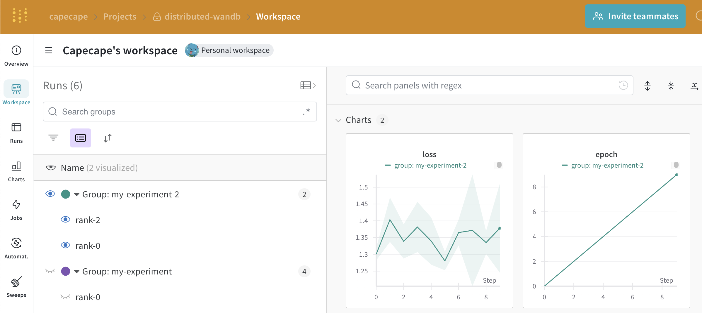

# Logging with Weights & Biases on Distributed Training

A small example of how to log your experiments with Weights & Biases on distributed training setups.

## Setup

This example uses the `torchrun` command to run the training script in parallel. You will need PyTorch, and the Weights & Biases library installed.

```bash
python -m pip install -r requirements.txt
```

## Multi GPU (1 machine, multiple processes)

When using W&B on distributed training setups, you will have to decide how do you want to log your experiments.

Most of the time you would want a single run to be logged as a single experiment. This is the case for our integrations, we default on creating a run on the `rank 0` process and logging the metrics after the "gather all" happens.

Basically, under the hood we do something like this:

```python
if rank == 0:
    wandb.init(project="distributed-example")


# in your code, we only log if there is an active run
if wandb.run:
    wandb.log(...)
```

If you don't do this, you will have multiple runs for each process, which can be a bit confusing. E.g., if you have 8 GPUs, you will have 8 runs for each experiment, but sometimes this can be useful and desired.

We also enable users to bypass this in our integrations by letting them create their run (call `wandb.init` manually) and then use the integration. This is the case if you use the transformers integration. 

A good trick when logging multiple runs is using the `group` parameter so you can visualize the runs in the W&B UI. This is useful for keeping track of the runs for a given experiment that were created in different processes.
```python
# create a run on every process and group them by experiment
wandb.init(project="distributed-example", group="my-experiment")
```

In practice, when using PyTorch, the forking and creation of the processes is done by using the `torchrun` command. This will run the training script in parallel. 

> It takes care of setting the `RANK` and `LOCAL_RANK` environment variables correctly.

```bash
torchrun --nproc-per-node 4 distributed.py --log_strategy all --group_name my-experiment
```


## Multi GPU + Multi Node(2+ machines, multiple processes)

You are the lucky owner of a multi-node setup. You want to run your experiment on 2 machines, with 8 GPUs each. (16 total processes)

Depending on you setup and how your code is instrumented, you have 3 options:

- log all metrics on the `rank 0` process of the main machine  -> 1 run
- log all metrics on the `rank 0` process of the main and the secondary machine -> 2 runs
- log all metrics on every process -> 16 runs

PyTorch creates a bunch of environment variables to help you with distributed training.

- `rank`: The rank of the current process in the group, in our case from 0 to 15.
- `local_rank`: The rank of the current process on the current machine, in our case from 0 to 7 in each machine.
- `world_size`: The total number of processes in the group, in our case 16.

The logging strategy will depends on the `rank` and `local_rank` of the process:

```python
if (rank == 0 and log_strategy == "main"):
    # only log on rank0 process
    wandb.init(project="distributed-wandb", 
                group=group_name,
                config=config)
elif (local_rank == 0 and log_strategy == "node"):
    # log on local_rank==0 on each node
    wandb.init(project="distributed-wandb", 
                name=f"rank-{rank}",
                group=group_name,
                config=config)
elif log_strategy == "all":
    # log on all processes and group them by rank
    wandb.init(project="distributed-wandb", 
                name=f"rank-{rank}",
                group=group_name, 
                config=config)
```

You can try this by running:
- Run on one terminal:

```bash
torchrun \
  --nproc-per-node 2 \
  --nnodes 2 \
  --master_port=1234 \
  --master_addr=localhost \
  --node_rank 0 \
  distributed.py \
    --log_strategy node \
    --group_name my-experiment-2
```
- Run on another terminal:

```bash
torchrun \
  --nproc-per-node 2 \
  --nnodes 2 \
  --master_port=1234 \
  --master_addr=localhost \
  --node_rank 1 \
  distributed.py \
    --log_strategy node \
    --group_name my-experiment-2
```



## Artifacts and Model Checkpoints

Our integrations like HF and Lightning automatically log the model checkpoints and the optimizer states, but they are built to support single node training.

You can take over the logging of the model checkpoints and the optimizer states but you need to take care of:

- Wait for all process to finish and sync, this way you have the model state on the `rank 0` process.
- Log the model checkpoint and the optimizer state on the `rank 0` process.

You can achieve this by using some `torch.distributed` functionalities like `torch.distributed.barrier` to wait for all processes to finish and sync, and `torch.save` to save the model state. 

```python
if torch.distributed.get_rank() == 0:
    state_dict = {
        "model": model.state_dict(),
        "optimizer": optimizer.state_dict()
    }
    torch.save(state_dict, "my_awesome_model.pt")
    wandb_artifact = wandb.Artifact("my_awesome_model", type="model")
    wandb_artifact.add_file("my_awesome_model.pt")
    wandb.log_artifact(wandb_artifact)
```
