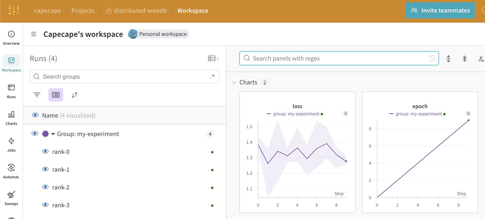

# Logging with Weights & Biases on Distributed Training

A small example of how to log your experiments with Weights & Biases on distributed training setups.

## Setup

This example uses the `torchrun` command to run the training script in parallel. You will need PyTorch, and the Weights & Biases library installed.

```bash
python -m pip install -r requirements.txt
```

## Multi GPU (1 machine, multiple processes)

When using W&B on distributed training setups, you will have to decide how do you want to log your experiments.

In this setup, most of the time you would want a single run to be logged as a single experiment. Most of our integration do this, by creating a run on the `rank 0` process and logging the metrics after the "gather all" step.

You achieve this by setting W&B to only create a run on the `rank 0`:

```python
if rank == 0:
    wandb.init(project="distributed-example")

```

If you don't do this, you will have multiple runs for each process, which can be a bit confusing. E.g if you have 8 GPUs, you will have 8 runs for each experiment. Sometime this can be useful and desired.

A good trick is using the `group` parameter so you can visualize the runs in the W&B UI. This is useful to keep track of the runs for a given experiment.

```python
# create a run on every process and group them by experiment
wandb.init(project="distributed-example", group="my-experiment")
```

In practice, when using PyTorch, this is accomplished by using the `torchrun` command to run the training script in parallel. This way, the `rank` and `local_rank` environment variables are set correctly.

```bash
torchrun --nproc-per-node 4 --log_strategy all --group_name my-experiment
```



## Multi GPU + Multi Node(2+ machines, multiple processes)

You are the lucky owner of a multi-node setup. You want to run your experiment on 2 machines, with 8 GPUs each. (16 total processes)

Depending on you setup and how your code is instrumented, you have 3 options:

- log all metrics on the `rank 0` process of the main machine  -> 1 run
- log all metrics on the `rank 0` process of the main and the secondary machine -> 2 runs
- log all metrics on every process -> 16 runs

Just to fix ideas, PyTorch creates a bunch of environment variables to help you with distributed training.

- `rank`: The rank of the current process in the group, in our case from 0 to 15.
- `local_rank`: The rank of the current process on the current machine, in our case from 0 to 7 in each machine.
- `world_size`: The total number of processes in the group, in our case 16.

The logging strategy then depends on the `rank` and `local_rank` of the process:

```python
if (rank == 0 and log_strategy == "main"):
    # only log on rank0 process
    wandb.init(project="distributed-wandb", 
                group=group_name,
                config=config)
elif (local_rank == 0 and log_strategy == "node"):
    # log on local_rank==0 on each node
    wandb.init(project="distributed-wandb", 
                name=f"rank-{rank}",
                group=group_name,
                config=config)
elif log_strategy == "all":
    # log on all processes and group them by rank
    wandb.init(project="distributed-wandb", 
                name=f"rank-{rank}",
                group=group_name, 
                config=config)
```

You can try this by running:
- Run on one terminal:

```bash
torchrun --nproc-per-node 2  --nnodes 2 --master_port=1234 --master_addr=localhost --node_rank 0 \
    distributed.py --log_strategy node --group_name my-experiment-2
```
- Run on another terminal:

```bash
torchrun --nproc-per-node 2  --nnodes 2 --master_port=1234 --master_addr=localhost --node_rank 1 \
    distributed.py --log_strategy node --group_name my-experiment-2
```

